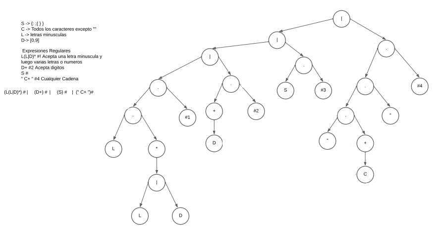
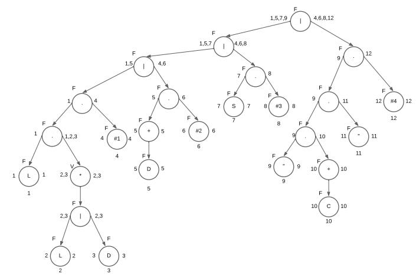
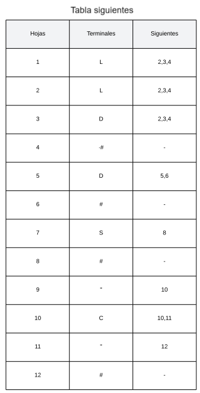
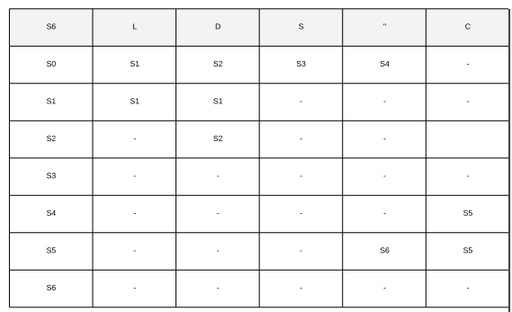
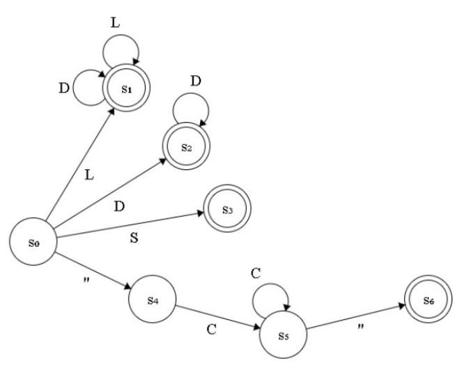

# Manual Técnico

Aplicacion desarrollada en:

* Frontend:
  * Python 3.12.2
* Backend:
  * GNU Fortran (tdm64-1) 10.3.0
  * dot - graphviz 12.1.0

## Backend

### AFD a través del método del árbol

Se crea el árbol del lenguaje, se aplican las condiciones especificadas, donde se sigue la estructura de los elementos que puede manejar el programa, iniciaindo por las letras mayúsculas, las minúsculas, los números y los caracteres especiales que son necesarios para la estructura del mismo.

Se analizan los nodos si son anulables, los primeros y los últimos.

En base a la información se crea la tabla de siguientes para cada hoja, con su respectiva columna de terminales y siguientes.

En base a la tabla de siguientes se crea la tabla de estados.

Teniendo la tabla de estados, se crea el Autómata Finito Determinista (AFD).

### Analizador léxico

Se crean todas las variables necesarias para llevar a cabo el análisis léxico. Se utiliza la variable type para simular las clases:

* ErrorInfo: Almacenará los errores del análisis léxico, poseerá información del caracter que causa el error, una pequeña descripción del error, la columna y fila en donde se encuentra.
* TokenInfo: Almacenará los tokens del análisis léxico, poseerá información del caracter o cadena de caracteres que conforman el token, una pequeña descripción del token, la columna y fila en donde se encuentra.
* ContinenteInfo: Almacenará la información del continente, agregandole el nombre que se recibe del archivo de entrada y asignandole el número de continente que es.
* PaisInfo: Almacenará la información de los bloques pais que recibe del archivo de entrada. Contendrá el nombre del país, la población, la saturación del mercado la ruta a la bandera del país, y el número de continente al que pertenece.

Una vez definidas las clases se le asigna el nombre de una variable y se le da un tamaño lo suficientemente grande para manejar la información que analizará. Se inicializa la variable contenido, que será la encargada de almacenar toda la información que se recibe del Frontend. A traves de un ciclo do, se lee la información del archivo abierto por python y se almacena en una variable buffer, cada salto de línea se concatena la información del contenido, la del buffer y la del mismo salto de línea.

Una vez recibida la información se define el lenguaje que el analizador es capaz de soportar. Este lenguaje esta conformado por:

* Letras mayúsculas: 26 letras mayusculas del idioma español (A-Z)
* Letras minúsculas: 26 letras minúsculas del idioma español (a-z)
* Carácteres especiales: Serie de 6 caractéres que se utilizan para separar los elementos del archivo de entrada (':','{','}',';',' " ', "%")

Cualquier elemento fuera de este lenguaje será manejado como un error léxico.

Con la función `len_trim()` se conocerá el tamaño de la variable contenido, esto con la finalida de realizar un ciclo do, iniciando en 1 y terminando en el tamaño total del contenido. Al momento de recorrer el contenido se utilizar una variable auxiliar llamada "char", a la que se le asigna el valor del caracter a analizar de la variable contenido.
Al momento de analizar el contenido del texto, puede contener espacios en blanco, saltos de línea y tabulaciones, esto no se analiza en el analizador léxico, por lo que se omiten con la ayuda del código ASCII de los mismos (salto de línea = 10, tabulación = 9 y espacio en blanco = 32), la función `ichar(char)` es la encargada de analizar el código ASCII del caracter, una vez analizada se pasa al siguiente caracter. En caso contrario se analizará el caracter con una secuencia Select case, en donde se manejará el caracter como un estado, iniciando en el estado 0

* Estado 0:
  Analiza que el primer caracter a recibir sea una letra perteneciente al lenguaje de letras minusculas, si se encuentra con esta condición se avanzará al estado 1 y se almacenará el caracter en una variable para mostrar los tokens llamada "tkn" (`tkn = trim(tkn) // char`). En caso de no ser una letra mayuscula se informará de cambiarla a minuscula para seguir con el lenguaje definido. En caso de ser cualquier otro caracter, se manejará como un error léxico.  
* Estado 1:
  Recibe el siguiente caracter y lo analiza, si es una letra minuscula perteneciente al lenguaje, almacena el caracter para formar la cadena que formará el token que esta analizando, se permanecerá en este estado hasta que el caracter a analizar sea cualquier componente del lenguaje de simbolos, en caso de ser asi se almacenará el token que se ha formado hasta el momento en un arreglo de la clase TokenInfo y se pasará al estado 2. En caso contrario se manejará como un error léxico.
* Estado 2:
  Si el caracter analizado es un elemento del lenguaje de símbolos, se guarda el token de la candena de elementos que se encontraron antes del símbolo, el token del simbolo que se encontró y se avanza al estado 3. En caso contario se manejará como un error léxico.
* Estado 3:
  Este estado es capaz de analizar 3 posibles entradas. En caso de que el caracter sea un elemento perteneciente al lenguaje de letras minusculas se captura el caracter, se agrega a la cadena del token y se devuelve al mismo estado 3. En caso de que el caracter sea un elemento del lenguaje de simbolos (exceptuando al simbolo " " ") se almacenará la cadena anterior al simbolo como un token, de igual manera se almacena el token del simbolo y se devuelve al estado 3. En caso de ser el simbolo de comilla " se iniciará el nuevo token guardando la misma comilla y avanzando al estado 4.  En caso contario se manejará como un error léxico.
* Estado 4:
  Por la definición de nuestro lenguaje, el nombre de la grafica puede contener cualquier nombre, es decir, cualquier combinación de letras mayúsculas y minúsculas, cualquier elemento perteneciente o no pertenciente a la lista de simbolos y hasta números, por lo que en este estado solo se capturan los caracteres y se concatenan hasta que se encuentre de nuevo una comilla. En caso de encontrarla se concatena la cadena final y se guarda como un token, además se guarda con una variable auxiliar, esto con el fin de capturar el nombre de la grafica para generarla en graphviz y se avanza al estado 5.
* Estado 5:
  Valida que el caracter siguiente sea un elemento del lenguaj de simbolos, en caso de ser así se guarda el token de ese simbolo y se avanza al estado 6.  En caso contario se manejará como un error léxico.
* Estado 6:
  Si el caracter es un elemento perteneciente al lenguaje de letras minusculas se captura el caracter y se concatena en el nuevo token hasta que encuentre un simbolo del lenguaje, en ese caso guarda el token anterior, el token del simbolo encontrado y avanza al estado 7.  En caso contario se manejará como un error léxico.
* Estado 7:
  Valida que seguido a un simbolo, siga otro simbolo, si lo encuentra se almacena el token de dicho simbolo y se avanza al estado 8. En caso contario se manejará como un error léxico.
* Estado 8:
  Si el caracter analizado es cualquier elemento del lenguaje de letras minusculas se captura el caracter y se concatena para crear el token, se regresa al estado 8 hasta que el caracter sea igual a cualquier elemento del lenguaje de simbolos. En caso de ocurrir se almacena el token anterior, el token del simbolo y se avanza al estado 9.  En caso contario se manejará como un error léxico.
* Estado 9:
  Valida que despues del simbolo se encuentre una comilla para iniciar la nueva cadena, se inicia a concatenar el nuevo token y se avanza al estado 10.  En caso contario se manejará como un error léxico.
* Estado 10:
  Valida que al iniciar el nombre del continente se encuentre un elemento del lenguaje de letras mayusculas, si lo encuentra se avanza al estado 11.  En caso contario se manejará como un error léxico.
* Estado 11:
  Recibe cualquier combinación de elementos del lenguaje de letras mayúsculas y de letras minúsculas, cada vez que reciba una se concatena al token. En caso de que el caracter sea una comilla, se concatena el token y se almacena como una variable de tipo Continente en donde se guarda el nombre y el número de continente, se avanza al estado 12. En caso contario se manejará como un error léxico.
* Estado 12:
  Valida que despues de cerrarse las comillas se enucentre con otro elemento del lenguaje de simbolos, si es así se crea el token del simbolo y se avanza al estado 13. En caso contario se manejará como un error léxico.
* Estado 13:
  Acepta cualquier letra minúscula, si es así concatenará el caracter al token y ejecutará el estado 13 hasta que el caracter sea igual al elemento del lenguaje de simbolos :, si lo lee concatenará y almacenará el token de la cadena anterior, el token del simbolo y avanzará al estado 14. Si encuentra una letra mayúscula se agregará como error, pues las palabras reservadas del lenguaje deben ser escritas en minúsculas. En caso contario se manejará como un error léxico.
* Estado 14:
  Verifica que el caracter sea igual a una llave de apertura ({), si es así se agrega el token y se avanza al estado 15. En caso contario se manejará como un error léxico.
* Estado 15:
  Si el caracter es un elemento del lenguaje de letras minúsculas se concatena para formar el token y se vuelve a ejecutar el estado 15 hasta que encuentre alguno de los siguientes casos. El caracter es igual al simbolo ":", en este caso se guarda el token, el token del simbolo ":" y se avanza al estado 16. Además a esto se maneja el token dependiendo de lo que diga (Si es "nombre" se manejará en un caso 1, si es "poblacion" se menejará en un caso 2, si es "saturación" se manejará en un caso 3, si es "bandera" se manejará en un caso4). Sí el caracter es igual al simbolo de cierre "}" se guardará el token del simbolo y se avanza al estado 17. En caso de que el caracter sea un elemento del lenguaje de letras mayúsculas se manejará como un error, pues las palabras reservadas del lenguaje deben ser escritas en minúsculas. En caso contario se manejará como un error léxico.
* Estado 16:
  Se recibe el caracter y se concatena para crear el token, hasta que el caracter sea un símbolo  ";", en ese caso se almacenará el token de la cadena anterior y del símbolo ";". Además, dependiendo el caso que se recibió del estado anterior se almacena la información en el `typo Pais`, se almacena el nombre, la saturación, la bandera la población y el número de continente al que pertenece. Devuelve al estado 15.
* Estado 17:
  Valida si luego de cerrar un bloque país aparece un nuevo bloque país, en cuyo caso lo valida a través de la aparición cualquier elemento del lenguaje de letras minúsculas. Si se recibe un nuevo bloque continente se devuelve al estado 13. Si el carácter es igual a un corchete de cierre "}", se guarda el token del símbolo y se vanza al estado 18. En caso contario se manejará como un error léxico.
* Estado 18:
  Si el caracter es un corchete de cierre "}", se guarda el token del símbolo y se avanza al estado 19. Si el carácter es un elemento del lenguaje de letras minúsculas, se almacena el caracter y se concatena para crear el token correspondiente, devuelve al estado 6. En caso contario se manejará como un error léxico.
* Estado 19:
  Valida que el último caracter sea un corchete de cierre "}", si es así se almacena el token del símbolo y se termina la fase del analisador léxico. En caso contario se manejará como un error léxico.

### Salidas

Si la cantidad de número de errores es mayor a 0, se llamará a la subrutina `generar_html_errores()`, a la que se le pasará como parámetros el número de errores, y el arreglo errores que contiene la información de los errores del analizador léxico.
Caso contrario, en que la cantidad de errores sea 0, se llamará a las subrutinas `generar_html_tokens()` que recibe como parámetros el número de tokens y el arreglo que contiene la información de los tokens, `graficar()` que recibe el nombre de la gráfica, el arreglo de continentes y el arreglo de paises, y `generar imagen`.

~~~ Fortran
if (numErrores > 0) then
      call generar_html_errores(numErrores, errores)
    else
      call generar_html_tokens(numTokens, tokens)
      call graficar(G_Nom, Continente, Pais)
      call generar_img
end if
~~~

#### HTML Errores

Una vez llamada esta subrutina abrirá o creará un archivo llamado errores.html, en él escribirá la información de los errores encontrados en el análisis léxico. Con el código siguiente se agregan la información de las columnas de cada fila i de los errores encontrados.

~~~FORTRAN
do i = 1, numErrores
       write(str_no, '(I0)') i
       write(str_descripcion, '(A)') trim(errores(i)%descripcion)
       write(str_columna, '(I0)') errores(i)%columna
       write(str_linea, '(I0)')  errores(i)%linea
       write(char_error, '(A)') trim(errores(i)%caracter)
       write(file_unit, '(A)') '<tr><td>' // str_no // '<td>' // char_error &
       // '</td><td>' // trim(str_descripcion) // & 
      '</td><td>' // trim(str_columna) // '</td><td>'&
       // trim(str_linea) // '</td></tr>' // new_line('a')
end do
~~~

#### HTML Tokens

Una vez llamada esta subrutina abrirá o creará un archivo llamado tokens.html, en él escribirá la información de los tokens encontrados en el análisis léxico. Con el código siguiente se agregan la información de las columnas de cada fila i de los errores encontrados. Además de que identifica el tipo de token que es y se escribirá en la tabla del html.

~~~Fortran
    do i = 1, numTokens
      write(str_no_T, '(I10)') i
      if (trim(tokens(i)%token) == 'grafica' .OR. trim(tokens(i)%token) == 'nombre'&
      .OR. trim(tokens(i)%token) == 'continente' .OR. trim(tokens(i)%token) == 'pais'&
      .OR. trim(tokens(i)%token) == 'poblacion' .OR. trim(tokens(i)%token) == 'saturacion'&
      .OR. trim(tokens(i)%token) == 'bandera') then
      write(str_descripcion, '(A)') 'Palabra reservada'
        else if (trim(tokens(i)%token) == ':') then
          write(str_descripcion, '(A)') 'Dos puntos'
        else if (trim(tokens(i)%token) == '{') then
          write(str_descripcion, '(A)') 'Llave de apertura'
        else if (trim(tokens(i)%token) == '}') then
          write(str_descripcion, '(A)') 'Llave de cierre'
        else if (any(tokens(i)%token == N)) then
          write(str_descripcion, '(A)') 'Número'
        else if (trim(tokens(i)%token) == ';') then
          write(str_descripcion, '(A)') 'Punto y coma'
        else
          write(str_descripcion, '(A)') 'Cadena'
        end if
      write(str_columna, '(I0)') tokens(i)%columna_T
      write(str_linea, '(I0)')  tokens(i)%linea_T
      write(tok, '(A)') trim(tokens(i)%token)
      
      write(file_unit, '(A)') '<tr><td>' // str_no_T // '</td><td>'&
      // tok // &
      '</td><td>' // trim(str_descripcion) // & 
      '</td><td>' // trim(str_columna) // '</td><td>'&
      // trim(str_linea) // '</td></tr>' // new_line('a')
    end do
~~~

#### Grafica en Graphviz

Se crea o actualiza un archivo de extensión .dot, para crear la gráfica en graphviz, se empieza a escribir en el documento. Se crea la gráfica G, con el nombre ingresado por usuario, se le asigna la forma de un rombo y se crea el nodo que tendran los continentes y paises a mostrar.

~~~FORTRAN
        write(10, *) "    digraph G{   "
        write(10, *) "    Nombre [label="" ",TRIM(Graph)," "", shape = diamond];"
        write(10, *) "    node [shape=box, style=filled];"
~~~

Se inicia a escribir los continentes y los paises que posee, según la saturación del país se les agrega el color correspodiente.

~~~Fortran
if (int_saturacion <= <Condición>)then
  write(10, *) "    Pais",TRIM(str_j), "[label= """ ,TRIM(P_nom),"\n",TRIM(Pais(j)%saturacion), "%""];"
  write(10, *) "    Continente",TRIM(str_i), " -> Pais",TRIM(str_j),";"
  write(10, *) "    Pais",TRIM(str_j), " [fillcolor=white];"
end if
~~~

Posterior a ello, se calcula la saturación continental en base a los paises, y se le asigna el color correspondiente al nodo continente, agregando las conexiones necesarias para generar de manera correcta la gráfica.

~~~FORTRAN
if (sat_cont <= <Condición>)then
  write(10, *) "    Continente",TRIM(str_i), "[label= """ ,TRIM(C_nom),&
  "\n", TRIM(T_sat_cont),"%""];"
  write(10, *) "    Nombre -> Continente",TRIM(str_i),";"
  write(10, *) "    Continente",TRIM(str_i), " [fillcolor=white];"
end if
~~~

Se agrega la cantidad necesaria condiciones y se cierra el archivo, con esto se creará la gráfica en .dot, por lo  se realiza una llamada al sistema, para poder generar la imagen de la misma, esto se realiza con el código:

~~~FORTRAN
    comando = "dot -Tpng  ..\Out\graph.dot -o ..\Out\graph.png"
    call system(comando)
~~~

#### País seleccionado

La selección del país con menor saturación se realiza hayando el país con la menor saturación global, se recorre el arreglo de País en la característica de saturación, se busca el menor de todos. En caso de tener dos o más valores igual de bajos, se seleccionará el país con la menor saturación continental, esto se realiza en el segundo ciclo if anidado.

~~~FORTRAN
    minimo = S_P(1)
    C_min = S_C(1)
    do i = 1, l-1
        if (S_P(i) < minimo) then
          minimo = S_P(i)
          Aux_sat1 = i
        else if(S_P(i) == minimo)then
            do j = 1, k-1
                if(S_C(Pais(i)%conti) < S_C(i)) then
                    PaisSel(1)%nombre = Pais(i)%nombre
                    PaisSel(1)%poblacion = Pais(i)%poblacion
                    PaisSel(1)%saturacion = Pais(i)%saturacion
                    A_ruta = Pais(i)%bandera
                    A_ruta = A_ruta(2:len_trim(A_ruta)-1)
                    PaisSel(1)%bandera = A_ruta
                    Aux_sat1 = i
                else 
                    PaisSel(1)%nombre = Pais(Pais(i)%conti)%nombre
                    PaisSel(1)%poblacion = Pais(Pais(i)%conti)%poblacion
                    PaisSel(1)%saturacion = Pais(Pais(i)%conti)%saturacion
                    A_ruta = Pais(Pais(i)%conti)%bandera
                    A_ruta = A_ruta(2:len_trim(A_ruta)-1)
                    PaisSel(1)%bandera = A_ruta
                    Aux_sat1 = i
                end if
            end do
        end if
    end do

    PaisSel(1)%nombre = Pais(Aux_sat1)%nombre
    PaisSel(1)%poblacion = Pais(Aux_sat1)%poblacion
    PaisSel(1)%saturacion = Pais(Aux_sat1)%saturacion      
    A_ruta = Pais(Aux_sat1)%bandera
    A_ruta = A_ruta(2:len_trim(A_ruta)-1)
    PaisSel(1)%bandera = A_ruta
~~~

Una vez seleccionado el país destino se devuelve el valor para que sea mostrado por python en el frontend.

~~~FORTRAN
write(*,*) TRIM(PaisSel(1)%nombre),",",&
        TRIM(PaisSel(1)%poblacion),",",&
        TRIM(PaisSel(1)%saturacion),",",&
        TRIM(PaisSel(1)%bandera)
~~~

## Frontend

Aplicación desarrollada con la libreria tkinter.
Se crea la ventana principal del programa, con un tamaño establecido del 1300x600 px, esta ventana puede cambiar su tamaño para una mejor vista del contenido.

~~~PYTHON
Principal = Tk()
Principal.title("Lenguajes Formales y de Programación B-: PROYECTO 1")
Principal.iconbitmap("icono.ico")
Principal.resizable(1,1)    
Principal.geometry("1300x600")
Principal.config(padx=10, pady=35, bg="black" )
~~~

En la parte superior se cre un menu para poder desplegar las funciones de guardar, guardar como, cargar el archivo de entrada, acerca de y de salida de la aplicación.

~~~PYTHON
menu_bar = Menu(Principal)
Principal.config(menu=menu_bar)
menu_opciones = Menu(menu_bar, tearoff=0)
menu_bar.add_cascade(label="Menu", menu=menu_opciones)
menu_opciones.add_command(label="Abrir", command = abrir)
menu_opciones.add_command(label="Guardar", command = guardar)
menu_opciones.add_command(label="Guardar como", command = Guardar_Como)
menu_bar.add_command(label="Acerca de", command = acerca_de)
menu_bar.add_command(label="Salir", command= salir)
~~~

Dentro de este menú se podrá llamar a las funciones:

* Salir:

Permite cerrar la aplicación y cerrar la misma.

~~~PYTHON 
def salir():
    resp = messagebox.askquestion("Salir", "¿Está seguro que desea salir?")
    if resp == "yes":
        Principal.quit()
~~~

* Acerca de:

Proporciona información de quién desarrolla la aplicación.

~~~PYTHON  
def acerca_de():
    messagebox.showinfo("Acerca de", "Lenguajes Formales y de programación B-\n David Andrés Jimenez Paniagua\n 202004777") 
~~~

* Abrir

Función encargada de abrir archivos y colocarlos en el textbox del frame de entrada. Esta área funciona como un editor de texto.

~~~PYTHON
archivo_actual = None
def abrir():
   global archivo_actual
   file = filedialog.askopenfilename(
        title = "Seleccione un archivo",
        filetypes = (("ORG files", "*.ORG"), ("Todos los archivos", "*.*"))
    )
   if file:
       archivo_actual = file
   with open(file, "r") as f:
        messagebox.showinfo("Información", "Archivo cargado con éxito")
        contenido = f.read()
        TxtBox_E.delete(1.0, END)
        TxtBox_E.insert(1.0, contenido)
~~~

* Guardar

En caso de abrir un archivo anteriormente, guarda los cambios realizados al mismo, si no, se abrirá una ventana para guardar el área de texto como un nuevo documento .ORG.

~~~PYTHON
def guardar():
    global archivo_actual
    if archivo_actual:
        with open(archivo_actual, "w") as f:
            contenido = TxtBox_E.get(1.0, END)
            f.write(contenido)
    else:
        Guardar_Como()
~~~

* Guardar como

Permite guardar la información del área de texto como un nuevo documento .ORG.

~~~PYTHON
def Guardar_Como():
    G_file = filedialog.asksaveasfilename(
        defaultextension=".ORG",
        filetypes = (("ORG files", "*.ORG"), ("Todos los archivos", "*.*")))
    if G_file is None:
        return
    else:
        G_file = open(G_file, "w")
        G_contenido = TxtBox_E.get(1.0, END)
        G_file.write(G_contenido)
        G_file.close()
~~~

Dentro de la ventana se crea un widget frame, que será el encargado de contener los dos frames de la aplicación, el frame de entrada y el frame de salida.

### Área de entrada

Compuesto por un textarea, donde el usuario podrá editar texto para su análisis y una scrollbar para que pueda navegar con mayor facilidad.

~~~PYTHON
TxtBox_E = Text(Frame_E)
TxtBox_E.pack(side=LEFT)
TxtBox_E.config(width="50", height="500", font=("Arial", 12), bg="Black", fg="White", insertbackground="White")
    #SCROLLBAR
scroll = Scrollbar(Frame_E)
scroll.pack(side=LEFT, fill=Y)
scroll.config(command=TxtBox_E.yview)
TxtBox_E.config(yscrollcommand=scroll.set)
~~~

Además se cuenta con botón para analizar el contenido del text area, al pulsarlo ejecutará la función Analizar(), que enviará la información al BAckend para su análisis.

~~~PYTHON
def Analizar(): 
    for widget in Frame_S.winfo_children():
        widget.destroy()

    data = TxtBox_E.get("1.0", END)
    # Compila y ejecuta el código Fortran
    comando = subprocess.run(
        ["gfortran", "-o", "..\Backend\main.exe", "..\Backend\main.f90"],  
        check=True  
    )
    resultado = subprocess.run(
        ["..\Backend\main.exe"],  # Ejecutable de Fortran
        input=data,  # la data que se manda a Fortran
        stdout=subprocess.PIPE,  # la data que viene de Fortran   
        text=True  # la salida se maneja como texto
    )
~~~

Es posible enlazar a un backend en fortran con la libreria Subprocess, esta envia y recibe información del archivo de fortran, es posible manejar la información a través de `output = resultado.stdout.strip()`. Una vez recibida la información del pais seleccionado, se agrega a un arreglo para manejar mejor la información y se agrega a variables auxiliare.

~~~PYTHON
datos = output.split(',')
  nombre = datos[0]   
  poblacion = datos[1]
  saturacion = datos[2]
  bandera = datos[3]
~~~

### Área de salida

Una vez recibidos los datos se tienen que mostrar en el frame de salida. Se crean labels que contienen la información recibida del país seleccionado.

~~~PYTHON
global imagenS
  imagenS = PhotoImage(file=bandera)
  Label(Frame_S, image=imagenS, height=160, width=100, bg="Black").pack( side = BOTTOM)
  Label(Frame_S, text="Población: "+poblacion, font=("Arial", 12), bg="Black", fg="White").pack(side=BOTTOM)
  Label(Frame_S, text="Nombre: "+nombre, font=("Arial", 12), bg="Black", fg="White").pack(side=BOTTOM)
  Label(Frame_S, text="País seleccionado:", font=("Arial", 12), bg="Black", fg="White").pack(side=BOTTOM)
~~~

Además se mostrará la imagen del gráfico generado, el gráfico estará en una ruta específica, por lo que python tratará de acceder a la misma, si el gráfico fue generado, se mostrará en el lado derecho de a ventana, en caso de no ser generado, se mostrará un espacio vacío. 

~~~PYTHON
  global imagen 
    imagen = PhotoImage(file="..\Out\graph.png")
    try:
         Label(Frame_S, image=imagen, width="800", height="400",bg="Black" ).pack(side = TOP)
    except:
         Label(Frame_S,width="700", height="300", bg="Black").pack(side = TOP)**
~~~

Es importante empaquetar `.pack()` cada elemento a mostrar, y terminar con un comando `Principal.mainloop()` para que la aplicación se ejecute sin ningún error.
