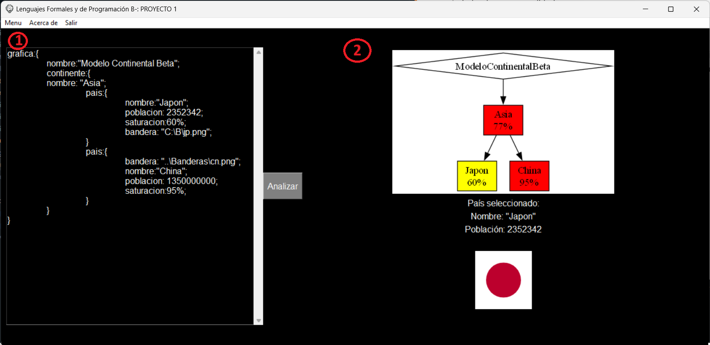
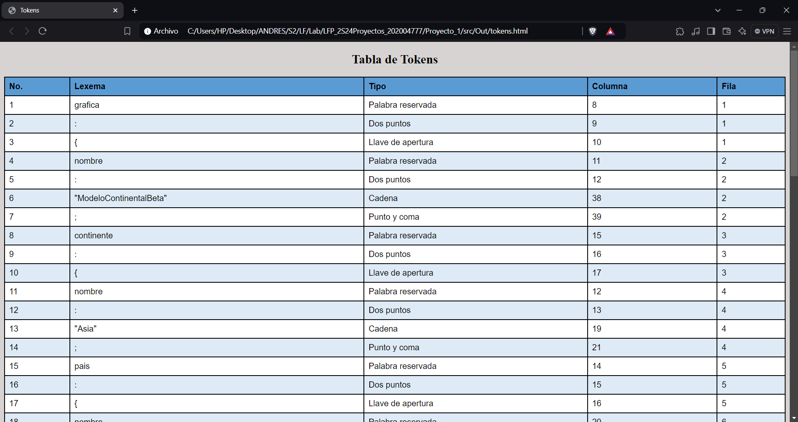
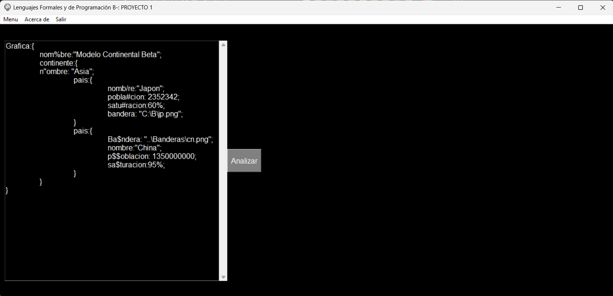
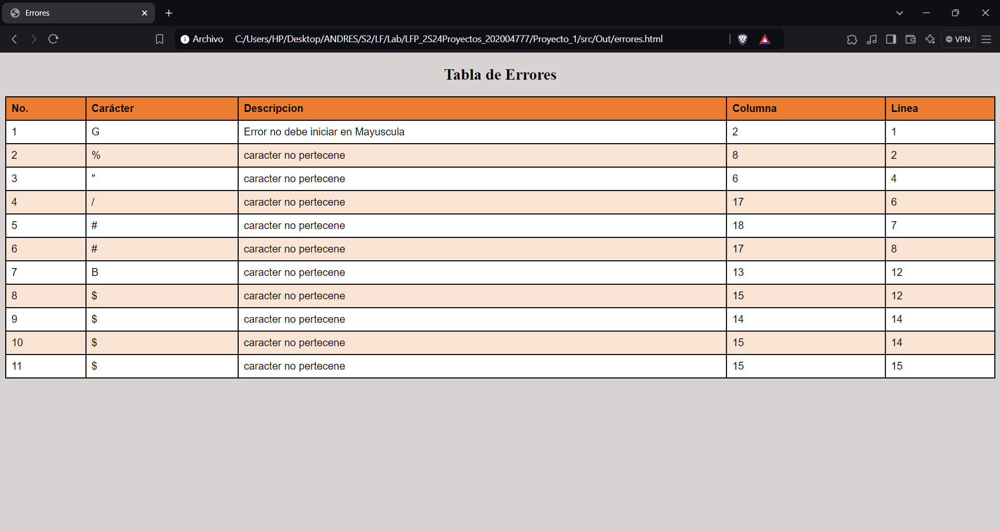

# Manual de Usuario

Al iniciar la aplicacion se mostrará la ventana:

Dicha ventana cuenta con un área de entrada y un espacio para la salida, además de un botón para analizar y un menú.

## Menú

Se dispone de un menú en la parte superior con los siguienes botones y su utilidad:

* Botón Menu:
  * Abrir: Al seleccionar el botón abrir se desplegará una ventana emergente del gestor de archivos, en él se podrá seleccionar el archivo que se quiere analizar. Dicho archivo de tener extensión .ORG.
  * Guardar: Este botón tiene la funcionalidad de guardar la información del área de edición en el mismo archivo que se ha abierto para editar. En caso de no haber abierto ningún archivo se desplegará una ventana del gestor de archivos para guardar la información del editor de texto en un nuevo documento con extensión predetrminada de .ORG.
  * Guardar como: Permite guardar la información del área de texto en un nuevo documento con el nombre que se desee, la extensión predeterminada será .ORG.
* Botón Acerca de:
  Al seleccionar este botón se desplegará un mensaje emergente en el que se contiene la información de quien realiza la aplicación.
* Botón Salir:
  La funcionalidad de este botón es de salir de la aplicación, al seleccionarse se desplagará un mensaje emergente en el que se pregunte si se desea salir de la misma, si se selecciona "Sí" se cerrará, si se selecciona "No" se cierra la ventana emergente y se puede seguir trabajando con normalidad.

### Área de entrada

#### Area de edición de texto

Se encuentra en el lado izquierdo de la venta y se encuntra delimitado por un cuadrado blanco. Acá se mostrará y se podrá editar el texto del documento cargado para su análisis, o si se desea, se puede escibir en él sin la necesidad de cargar un archivo previo. El texto a analizar debe tener la siguiente estructura:

~~~

            Grafica: {
              nombre: <cadena>;
              <Bloques Continente>
            }
~~~

Donde:

* `<cadena>`: es una secuencia de caracteres delimitada por comillas dobles que denota el nombre del gráfico.
  
* `<Bloques Continente>`: puede venir uno o más bloques ‘Continente’ detallados a continuación.

En este bloque se describe un continente que contendrá uno o más destinos:

* `<cadena>`: es una secuencia de caracteres delimitada por comillas dobles que denota el nombre del
continente.

* `<Bloques Destino>`: Indica uno o más bloques destino definidos a continuación.
La sintaxis del Bloque Continente es la siguiente:

~~~
              Continente: {
                    nombre: <cadena>;
                    <Bloques Destino>
}

~~~
Bloque Destino:
En este bloque se describe uno de los destinos que pueden ser elegidos para poner la nueva sucursal. El destino será un país con datos que se detallan a continuación:

* `<Nombre>`: es una cadena que denota el nombre del país.
* `<Población>`: indica el número de personas en el país.
* `<Saturación>`: es un numero entero del 0 al 100 que indica el porcentaje de saturación del área.
* `<Imagen>`: es una cadena que indica la ruta de la imagen de la bandera del país.
Su sintaxis es la siguiente:

~~~
          País: {
                nombre: <cadena>;
                población:<Numero Entero>;
                saturación: <Numero porcentaje>;
                bandera: <Ruta>;
          }
~~~

A continuación, se detallan los elementos de la instrucción destino:

* `<cadena>`: es una secuencia de caracteres delimitada por comillas dobles.
* `<Número porcentaje>`: es un número entero del 0 al 100 que termina con el carácter ‘%’.
* `<Número entero>`: es un número entero.
* `<Ruta>`: es una cadena que contiene la ruta, delimitada por comillas dobles.
Dentro del bloque Grafica pueden venir uno o más bloques destino. Además, los datos que vengan dentro del bloque destino pueden venir en cualquier orden.

### Área de Salida

Ubicada en el lado derecho de la ventana (2), dispone de un botón para analizar el texto del editor de texto y de un área que mostrará la salida generada del archivo a analizar. Al inicio de la aplicación se mostrará un área vacia.

#### Botón Analizar

Se encuentra al lado derecho del editor de texto. Una vez agregado el texto se podrá pulsar y con esto se analizará el texto del editor de texto. Esto hará que sucedan 2 posibles escenarios:

##### Archivo sin errores

Si el texto analizado se presenta sin errores, se creará un archivo llamado tokens.html, en el que se podrá visualizar una tabla. Esta tabla contendrá todos los tokens del texto de entrada. Además se mostrará una gráfica en el área de salida con la información presentada. Además se mostrará el pais seleccionado con la menor saturación del mercado.

##### Archivo con errores

En caso de que el texto analizado presente errores léxicos, es decir, se presenten caracteres fuera del lenguaje, se creará un archivo llamado errores.html, en el que se podrá visualizar una tabla. Esta tabla contendrá todos los errores del texto de entrada, con una breve descripción y la posición en que se encuentra. En este caso el área de salida se quedará vacia, esperando que se realicen las modificaciones necesarias para poder mostrar la información requerida.

###### Ejemplo de un archivo son errores

###### Ejemplo de un archivo con errores

